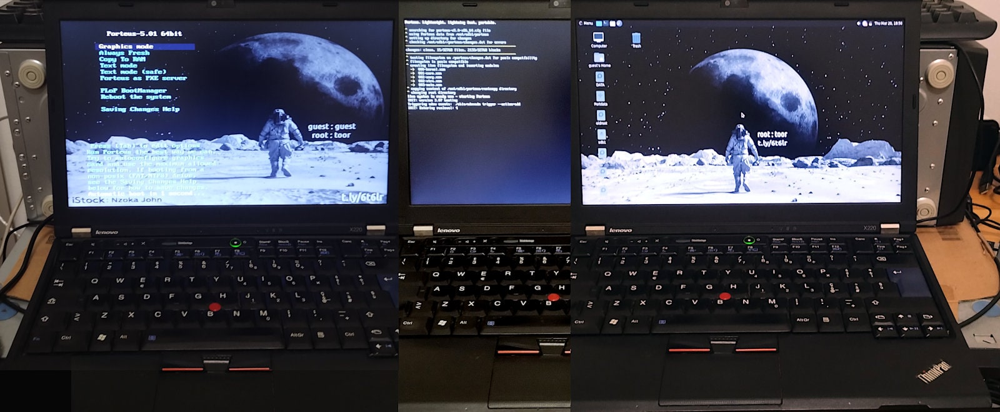

## Porteus live USB bootable installer

It creates a bootable USB with 128MB for persistence.

- Porteus root password: **toor**

- Background image source: [Newsweek](https://www.newsweek.com/government-report-new-space-race-nasa-china-1736843)

- Usage: `bash porteus-usb-install.sh /path/file.iso [/dev/]sdx [it] [--ext4-install]`
   - When everything is already local and updated as per the latest ISO.
   - Long option creates a USB bootable installation instead of a LIVE.
   - Performances LIVE vs EXT4 may greatly vary depending on USB stick.
   - First EXT4 installation boot is **slow** because lazy mkfs options.
   - Some USB2 sticks allow legacy boot only, it may be disabled in BIOS.

- Usage: `bash porteus-net-install.sh [<type> <url> <arch> <vers>] [/dev/sdx] [it]`
   - when downloading the ISO and retrieving this repo scripts is needed.

- Usage: `bash porteus-mirror-selection.sh [--clean]`
   - check among the available mirrors the fastest one for downloading.  

The v0.2.0 has been reported that it works also for [PorteuX](https://github.com/porteux/porteux) but I did not test it and I am not granting the compatibility for the future.

---

### Persistence vs Installation

<div align="justify">

> Persistence means that any changes you make to the system (like installing software, saving files, or changing settings) will be saved and available the next time you boot from the USB drive. Without persistence, the system would revert to its original state each time. Installation is a process designed to create a permanent and independent operating environment while a [LIVE](https://en.wikipedia.org/wiki/Live_USB) is running into the computer's RAM, mainly. This allows users to run an OS without modifying the host system's storage. Persistence, is a bridge between the two concepts. &ndash;&nbsp;Gemini&nbsp;2

</div>

To understand the difference between the two variants, the LIVE is the most similar to the original Porteus while the EXT4 allows one to install a system from scratch. The timings of these two examples are referring to Porteus v5.1 (alpha2) an USB 2.0 usbstick 64GB paid €3.11 on Temu:

```
INFO: Creation LIVE usbstick completed in 34 seconds.

Device     Boot   Start     End Sectors  Size Id Type
/dev/sda1  *       2048 2459647 2457600  1.2G  7 HPFS/NTFS/exFAT
/dev/sda2       2459648 3893247 1433600  700M 83 Linux

Filesystem        Size  Used Avail Use% Mounted on
/dev/sda1          16M   13M  3.5M  79% /tmp/usb1
/dev/sda2         1.8G  475M  1.3G  28% /tmp/usb2

INFO: Creation EXT4 usbstick completed in 38 seconds.

Device     Boot   Start     End Sectors  Size Id Type
/dev/sda1  *       2048   34815   32768   16M  7 HPFS/NTFS/exFAT
/dev/sda2         34816 3885055 3850240  1.8G 83 Linux

Filesystem        Size  Used Avail Use% Mounted on
/dev/sda1         1.2G  616M  583M  52% /tmp/usb1
/dev/sda2         672M   28K  623M   1% /tmp/usb2

INFO: boot by EXT4 ubstick, and to proceed with an installation type:

dd if=/dev/sdb bs=1M count=2k of=/dev/sda status=progress oflag=dsync

This will overwrite data on /dev/sda installing a working EXT4 system.
```

In this example the `/dev/sdb` is the usbstick while the `/dev/sda` is the internal storage device which is installed from scratch  (**WARNING**: data loss). For example, writing at 40M/s (USB 2.0) on average, it takes less than a minute for completing the installation.

---

### Preview on 13yo laptop

The ThinkPad X220 was released in April 2011 and was produced until mid-to-late 2012, when it was replaced by the ThinkPad X230. Today, it is a 13yo device and can be bought for around $100 as refurbished or used unit, only. Old but not obsolete.

In fact, it supports SATA2 SSD and 16GB of DDR3 RAM despite its specification indicates 8GB as maximum. While models with the i7-2620M typically include USB 3.0 support, also. However, usually it comes with 4GB of RAM, a 2.5" SATA HDD and USB 2.0, only. 

Porteus 5.01 Mate booting from an old SanDisk Cruzer Fit 32GB USB 2.0 and running on an ultra-old Thinkpad X220 equipped with 4GB of RAM. The storage stick is inserted in the USB 2.0 port, on the bottom left angle, and it is so short that it cannot even be seen without checking for it specifically for it.

<div align="center"></div><br>

How long does it take to prepare such a USB 2.0 stick with a 30MB/s of writing transfer rate? In about 30 seconds (since v0.3.x) with 128MB of persistence. Almost all the time is spent in writing the USB, hence that matters is the writing speed and data size.

#### About other buses/ports

An alternative to using a USB pendrive, is leveraging the internal u/SD reader, if it exists to save a USB port. In this case, it is useful to keep in mind that such embedded readers, like the one included into the Thinkpad **X201**, is limited by the USB version bus bandwidth. In that case the keywords for choosing a u/SD card are: `U3` and `A2` as mandatory, while `v30` and `XCI` as desirable.

So, it does not provide any advantages over the USB bus, and the same **might** apply also to the ExpressCard/54 slot using an adapter working as an USB device and limited to 133 MB/s on those rare units that have the USB 3.0. Instead, using the ExpressCard/54 with a PCIe adapter it can work at 250 MB/s which is near the 300M MB/s available on the internal SATA2.

In conclusion, a USB 2.0 laptop will be limited at 480 Mbps in accessing storage devices unless SATA2 or EC54/PCie is used. And in this particular case, the adoption of a ExpressCard/54 USB 3.0 adapter can provide that upgrade needed to leverage faster USB devices with low power consumption otherwise an extra power source is required.

Instead, the **X220**'s u/SD card reader is on the PCIe bus, so it is faster than USB 2.0 but is not among the bootable devices, unfortunately. However, there are two ways to overcome this issue: 

1. using [Coreboot](https://stoisavljevic.com/articles/coreboot) (aka LinuxBIOS) which is out of the chance of many;

2. boot from an USB device and with the u/SD into the internal reader, and the USB port **can** be freed ASAP the kernel + initrd image are loaded into the RAM, or later.

Noticeably, the USB boot can be replaced by the network boot initiated by the BIOS, or by an internal S/ATA device with a multi-OS bootloader for which Porteus on u/SD can be an alternative to Windows installed into the internal storage device. Just for sake of completeness, some micro-SD to SD form adapters are not working but fortunately `sudo dmesg -w` immediately tells about.

#### Booting from u/SD

The most convenient way to boot from a non-USB u/SD embedded card reader is to install a specific boot option into your grub/windows for a multi-boot system, or create the u/SD as an Moonwalker's Porteous EXT4/INST and the other one as Moonwalker's Porteous VFAT/LIVE (or traditional Porteous from its ISO). In that way the usbstick will serve as repair, maintenance and booting device while the other as a main installed Porteus. Alternatively, both devices in EXT4/INST and on the USB the 2nd partition can be formatted or removed, to gain more free space.

---

### Huston, we have a problem

On 25th March 2025, all Porteus mirrors are presenting zeroed sha256sums.txt, and it is quite a thing!


- Source: [A post of mine on forum.porteus.org](https://forum.porteus.org/viewtopic.php?p=102450#p102450)

Without those files the scripts in this project cannot work and making them working is unacceptably insecure.

---

### Default choices

This is a list of system choices that I made in advance for customising the Porteus **moonwalker** edition.

1. The script is not executable by default, hence it requires to be run by a shell. An extra caution: even if it requires root password, the session could be already on sudo or root.

2. I [decided](https://chatgpt.com/share/67e01ea8-a0f4-8012-9178-48d1c76337e9) to go without a journal within the persistent loop file because it is saved on a VFAT. It is faster and stresses the USB key less, and thus increases its durability.

3. To mitigate the Kiosk mode drawbacks, the lazy init of the EXT4 creates I/O workload until the filesystem is finalised and it depends on its size, both variants are limited to fit into a 2GB usbkey. In the LIVE this brings to have almost the same free space in the two partitions.

4. The size of the persistent loop file has been set to 128Mb in such a way there will be 430MB c.a. of free space to install optional modules. As much as the whole Porteus base.

5. With `--ext4-install`, the EFI boot partition size is 16 MB and remains 4 MB free by default with Porteus 5.01. It contains iso/syslinux and lilo stuff, the kernel and initrd.

6. The file `cmdline.txt` contains options for kernel line, by default it sets `noswap` and activate the IOMMU in passtrought mode for those machine that support it in full. The swap is not just a bottleneck but a performance killer, let the users deal with it manually when they desperately need it, only.

---

### Suggested choices

A set of choices that every Porteus user is going to face soon or later. The suggestions are not intended to be *good for all* but as a reasonable starting point for those whom are not technically skilled and might be puzzled by the great amount of choices that also live distro like Porteus can offer.

Some are *matter of taste* and in that cases, the most widespread options (or likely the most suitable similars) are chosen in order to let the beginners have as much large user-base as possible for asking support. Statistically speaking, giving them the highest chance to find someone that had solved those issues they most probably may face.

Porteus version: **MATE**

- Ubuntu is one of the most wide-spread and well-known Linux distributions.
- Ubuntu uses Gnome3 and the 2nd most appreciated flavour is the Mate one.
- Mate is based on Gnome2 and old PCs running Linux were usually adopting it.

USB stick: **Samsung FIT plus** [64GB](https://ssd-tester.com/samsung_fit_plus_64gb.html)

- It is very short, preventing USB port damage, essential for long-term use.
- Despite its size it is quite generous in size and [pretty fast](img/1st-topperf-branded-nano-usbstick.png) with USB 3.1.
- Whenever an old laptop/PC hasn't 3.x, exchanging data on 3.1 is faster.
- Check in the ThinkPaa X201 section [about](#about-other-busesports) using an micro-SD card, instead.

Full installation:

- Using `--ext4-install` implies that writing data is going to be a routine.
- The [256GB](https://ssd-tester.com/samsung_fit_plus_256gb.html) for a physical EXT4 persistence is 3x faster in WR on USB 3.x.
- If SATA2+ is available, at half of the price a 240GB+ [SSD](https://ssd-tester.com/sata_ssd_test.php?sort=250+GB) is another 3x faster.
- If USB 3.x then a SATA [adapter](https://raw.githubusercontent.com/robang74/porteus-usb-installer/refs/heads/main/img/usb3-sata3-adapter-with-plastic-case.webp) w/ABS case ($4) is faster, cheaper & easier.

Data encryption:

- It is unnecessary as long as we are using Porteus as testing/rescue distro.
- It is suggested for privacy when an external USB is used for personal needs.
- It is mandatory when we expect, even occasionally, to bring it out with us.

Download mirrors list:

- [porteus.org/porteus-mirrors.html](https://porteus.org/porteus-mirrors.html)

- [porteus-mirror-allhttps.txt](porteus-mirror-allhttps.txt) (local)

Installation tested:

- [Porteus-MATE-v5.01-x86_64.iso](https://linux.rz.rub.de/porteus/x86_64/current/Porteus-MATE-v5.01-x86_64.iso) (mainly)

- [Porteus-LXQT-v5.01-x86_64.iso](https://linux.rz.rub.de/porteus/x86_64/current/Porteus-LXQT-v5.01-x86_64.iso) (for QT lovers)

---

### Usage, quick & dirty

This little script downloads and immediately puts in execution the network installation . Which download the MATE version of the official Porteus ISO and a compressed archive of this repository chosen from [tags](https://github.com/robang74/porteus-usb-installer/tags) available. Check the [TODO](TODO) for knowing in advance about development and possible shortcomings.

```
mkdir -p usbtest; cd usbtest
tagver="v0.3.5" # To replace with the latest available in tags
rawurl="https://raw.githubusercontent.com/robang74"
rawurl="$rawurl/porteus-usb-installer/refs/tags/$tagver"
rawurl="$rawurl/porteus-net-install.sh"
DEVEL=0 # bash <(wget -qO- $net_inst_url)
```

At this point everything is ready to write the USB stick for having the desidered installation. It can be done by the USB installation script which requires `root` privileges. Because mistakes happen, the most safe way to proceed is to create a bootable USB stick in the way you're used to and transfer all the stuff into another USB stick.

Booting Porteus in RAM-only (Flash) mode, it will be possible to execute the scripts on the 2nd USB stick to install on the first which will be erased, or another one. In the future a 2nd USB key would not be necessary. A specific script will do everything in a RAM-only (Flash) running Porteuse, zeroing every risk.

```
mkdir -p usbtest; cd usbtest
wget -qO- http://alturl.com/ggvaa | tar xvz
mv porteus-usb-installer-main moonwalker
DEVEL=0 # bash moonwalker/porteus-net-install.sh
# or to simulate a remote call
# DEVEL=0 # bash <(cat moonwalker/porteus-net-install.sh)
```

If &ndash; **for you** &ndash; the shell code above does nothing, then it is ok in that way: do not use it. ;-)

---

### Future improvements

The script requires `bash` because it uses bashims. This should change in future, because I want to make it working also with busybox `a/sh`. Plus, before moving to try it on different systems than my laptop, I wish to create a net-installer that downloads all my stuff and the ISO and does the magic. This make sense because Porteus has the all-in-memory mode so we can download the ISO and write it directly on as USB:

- `wget -O- $url | sudo dd bs=1M of=/dev/sdx`

Then we can put that USB into a laptop/PC, boot in all-in-memory mode, clone the git and re-write that USB within a safe environment. Which is the reason because `dd` uses the `seek` option creating a virtual file that does not waste space, in evoluted filesystem that allows holes into files, at least.

When that file is copied into the VFAT32, then the holes are filled with zeros, hopefully. In fact, `cp` is supposed to not access the underlying physical device unless the kernel allocated blocks into the file instead of holes. This implies that we do not need extra 512Mb of free memory (or 128Mb per the last v0.2.5 version) to create those files but much less (c.a. 10Mb). While `/boot` `/syslinux` and `/porteus` folders are - supposedly - loaded in RAM, so we can rewrite the USB stick reading from the RAM filesystem.

If you would like to know more about future planning, read the [BOFH as lifestyle manifesto](bofh-as-life-style-manifesto.txt).

---

### On-demand USB live image

Why in 2025 we are still busy with ISO? Instead of having an on-demand USB bootable maker? What is necessary to have it? Under the DIY PoV, every device that makes sense to use despite its age is currently able to create an USB bootable (or install into an internal storage unit) a Linux live. Every device like an X220 can be turned into a Kiosk for such a task.

So, the first thing we need is a lightweight graphical - even running of framebuffer - operative system like [TinyCore](http://tinycorelinux.net/downloads.html). A lightweight browser like [Dillo](https://dillo-browser.github.io) would be enough to let the user cope with a simple HTML form that guides them to configure on-demand the installation.

At this point, we need to have a list of core components and a recipe to put all together. Which is the reason I developed this set of scripts. The next step is to provide a network connection to the Kiosk and while Wi-Fi is the easiest way especially using a smartphone like a router, usually the Wi-Fi card is a pain because proprietary firmware.

However, those USB dongle based on RTL8188 at 150 MBit/s - which were usually to find in Raspberry Pi kits - are almost universally supported by Linux. Having two USB 2.0 ports available is not a strict constraints: in one the Wi-Fi dongle ($2) and in the other a USB stick ($12) and the installation can start. Considering $1 of postal stamp, it sum-ups to $15.

---

### Kiosk mode & performances

The main idea is to create a bootable USB pendrive quick (kiosk mode) which EXT4 will be finalised during its use, **no matter when or how it would be detached from the USB port**. Read the last part again to appreciate the *magic*. Obviously, there is a drawback, the first time(s) in use, the system will appear a little slower in dealing with the writings.

So, the bootable USB stick is ready when the script tells you that you can safely detach it. **Instead**, if you live attached then the kernel will complete the work on the EXT4 filesystem. To see these actions, use `sudo iotop` with `CRTL-T` if that option is not enabled by default. You will see the kernel threads like tune2fs, mkfs.ext4 and dumpfs doing their job in the background.

This means that inserting this USB pendrive to rewrite it with the usb-install script will take you a much longer time. Because, the kernel will complete the previous tasks about finalising the EXT4 filesystem and **THEN**, it will provide to fulfill the duties related to write the data from the script. Unless `DEVEL_ZEROING=1` has been used before.

The `DEVEL_ZEROING=1` creates the bootable USB stick as usual and before the kernel gets in charge to finalise the EXT4 filesystems, it destroys them with zeros. The final outcome is a useless pendrive but it is immediately ready to be reused - even without detaching and re-attach to the USB port - for another usb-install round, as it were the first time.

This allows a developer or a tester to check the performance of the writing process in a quick and reliable manner. So, if you did not see the same performance claimed in the `README.md` of the related github project, now you know why. Counter fact-checking? Use iotop to see when the EXT4 finalising processes end, **THEN** check creation time. 

---

### Embedded systems

Are you more of an embedded guy/girl? In this case, I suggest [TinyCore](http://tinycorelinux.net/) Linux rather than Porteus which is more suitable for old hardware and kiosk systems. In particular, [TinyCore Editor](https://github.com/robang74/tinycore-editor) can serve you as a non-certifiable by design but functioning proof-of-concept system editor.

---

### Copyright

(C) 2025, Roberto A. Foglietta &lt;roberto.foglietta@gmail.com&gt;, licensed under BSD 3-clauses terms.

**Note**: the boot screen image, also used for background, is included here as per *fair-use* terms, only.
